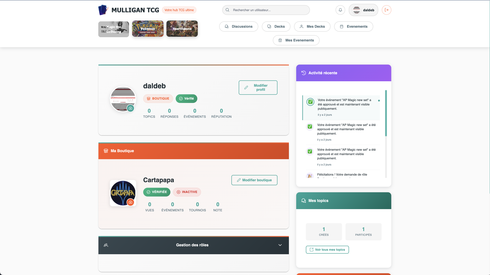
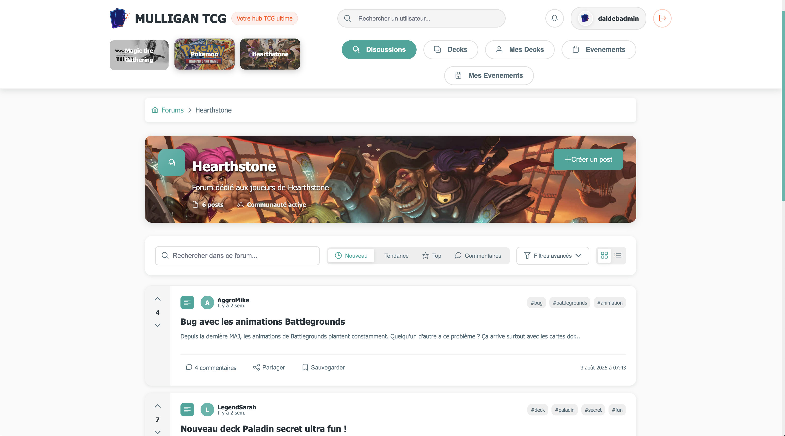
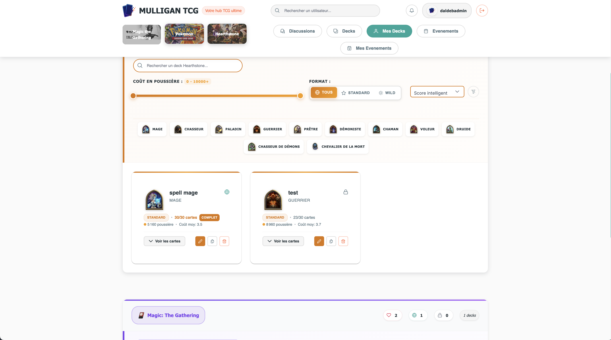
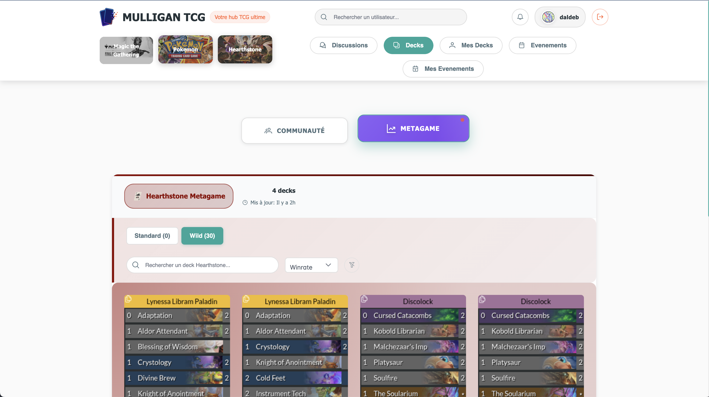
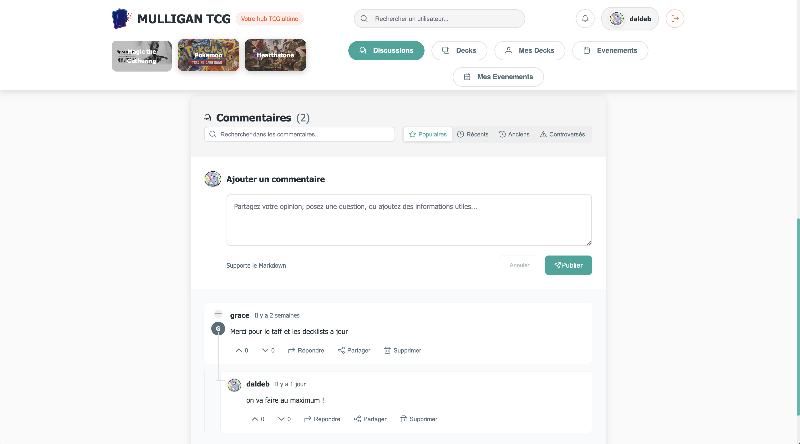
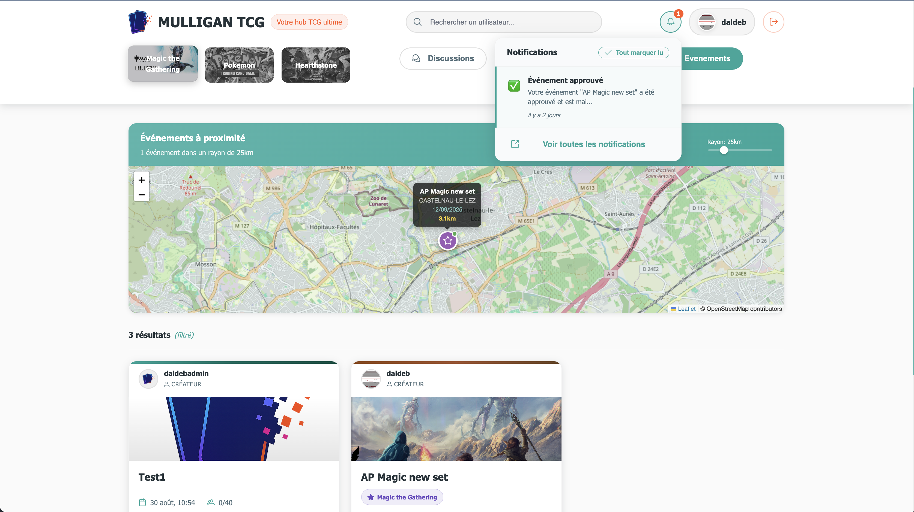
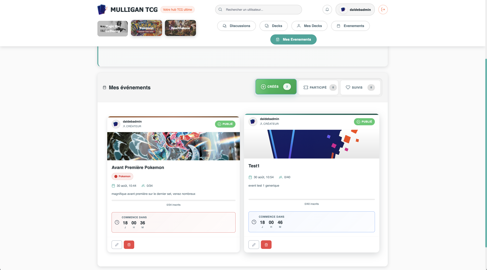
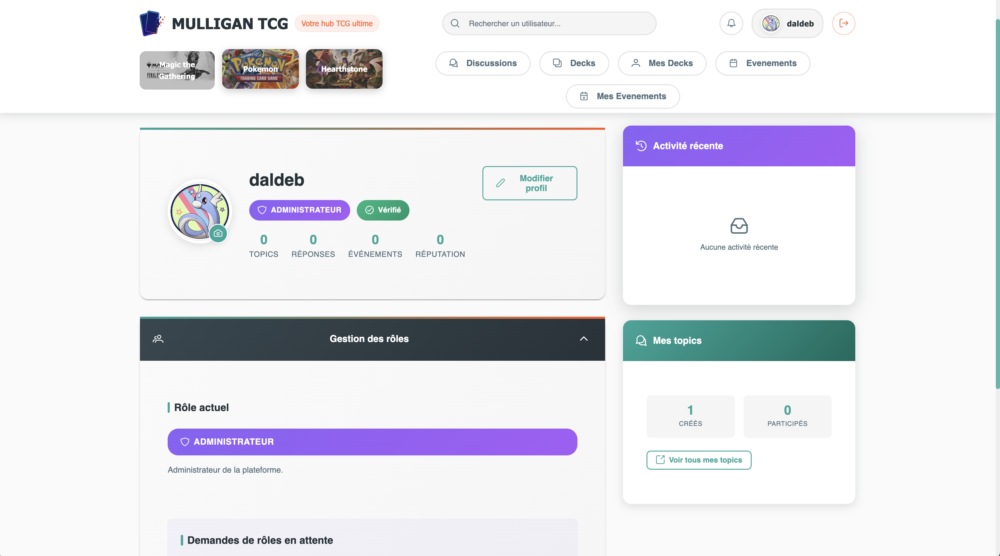

# MULLIGAN TCG — Plateforme de Trading Card Game

**MULLIGAN TCG** est une plateforme web complète dédiée aux joueurs et collectionneurs de cartes à collectionner (Trading Card Game). Le projet offre une expérience moderne et intuitive pour gérer sa collection, échanger des cartes, et participer à une communauté active de passionnés.


---

## Aperçu de l'Application

<div align="center">

### Interface Principale
| **Boutique** | **Forum & Posts** |
|:---:|:---:|
|  |  |

### Gestion de Decks & Communauté
| **Deck Builder** | **Community Decks Tracker** |
|:---:|:---:|
|  |  |

### Analytics & Méta
| **Méta Tracker** | **Posts Section** |
|:---:|:---:|
|  |  |

### Événements & Administration
| **Événements** | **Mes Événements** | **Interface Admin** |
|:---:|:---:|:---:|
|  |  |  |

</div>

---

## Présentation du Projet

### Vision
Créer la référence francophone pour les collectionneurs de cartes TCG avec une plateforme complète, sécurisée et moderne.

## Architecture Technique

### Stack Technologique

#### Backend - API REST
- **Framework** : Symfony 6.4 (PHP 8.2)
- **Base de données** : MySQL 8.0
- **Cache** : Redis 7
- **Authentification** : JWT (LexikJWTAuthenticationBundle)
- **ORM** : Doctrine
- **Validation** : Symfony Validator
- **Sérialisation** : Symfony Serializer

#### Frontend - SPA
- **Framework** : Vue.js 3 avec Composition API
- **Build Tool** : Vite
- **Routing** : Vue Router
- **State Management** : Pinia
- **HTTP Client** : Axios
- **UI/UX** : CSS3 moderne avec Flexbox/Grid

#### Infrastructure & DevOps
- **Conteneurisation** : Docker & Docker Compose
- **Reverse Proxy** : Nginx
- **CI/CD** : GitHub Actions
- **SSL** : Let's Encrypt (Certbot)
- **Monitoring** : Logs Docker + Symfony Profiler

### Architecture de Déploiement

```
┌─────────────────┐    ┌──────────────────┐    ┌─────────────────┐
│   Nginx Proxy   │    │   App Symfony    │    │  MySQL Database │
│   (Port 80/443) │◄──►│   (Backend API)  │◄──►│   (Port 3309)   │
└─────────────────┘    └──────────────────┘    └─────────────────┘
         │                        │                        │
         │                        ▼                        │
         │              ┌──────────────────┐               │
         │              │  Redis Cache     │               │
         │              │  (Port 6382)     │               │
         │              └──────────────────┘               │
         │                                                 │
         ▼                                                 ▼
┌─────────────────┐                              ┌─────────────────┐
│  Static Files   │                              │    Adminer      │
│  (Vue.js Build) │                              │  (Port 8084)    │
└─────────────────┘                              └─────────────────┘
```

---

## Installation et Développement

### Prérequis
- Docker & Docker Compose
- Node.js 18+ & npm
- Git

### Setup Initial

```bash
# 1. Cloner le repository
git clone git@github.com:Daldeb/mulligan-tcg.git
cd mulligan-tcg

# 2. Configuration de l'environnement
cp infrastructure/.env.example infrastructure/.env.prod
# ⚠️ Modifier .env.prod avec vos vraies valeurs

# 3. Installation des dépendances frontend
cd app/vuejs
npm install
cd ../..
```

### Développement Local

#### Backend (Symfony API)
```bash
# Démarrer l'environnement Docker
cd infrastructure
make up

# Générer les clés JWT (première fois)
make shell
php bin/console lexik:jwt:generate-keypair

# Migrations de base de données
php bin/console doctrine:migrations:migrate

# Charger des données de test (optionnel)
php bin/console doctrine:fixtures:load
```

#### Frontend (Vue.js)
```bash
# Dans un terminal séparé
cd app/vuejs
npm run dev
```

### URLs de Développement
- **Frontend** : http://localhost:5173
- **API Backend** : http://localhost:8000/api
- **Adminer (BDD)** : http://localhost:8081
- **Symfony Profiler** : http://localhost:8000/_profiler

---

## Docker & Containerisation

### Architecture des Containers

Le projet utilise une architecture multi-containers pour séparer les responsabilités :

#### Container Nginx (`tcg_prod_nginx`)
- **Rôle** : Reverse proxy et serveur de fichiers statiques
- **Ports** : 80 (HTTP), 443 (HTTPS)
- **Volumes** : 
  - Sites Nginx configurés
  - Build Vue.js pour le frontend
  - Certificats SSL Let's Encrypt

#### Container App (`tcg_prod_app`)
- **Rôle** : Application Symfony (API REST)
- **Ports** : 2223 (SSH pour debug)
- **Volumes** : Code source en bind mount
- **Environnement** : Variables de production chargées depuis `.env.prod`

#### Container MySQL (`tcg_prod_mysql`)
- **Rôle** : Base de données principale
- **Ports** : 3309 (exposition externe)
- **Volumes** : Données persistantes MySQL
- **Health Check** : Vérification automatique de connectivité

#### Container Redis (`tcg_prod_redis`)
- **Rôle** : Cache et sessions
- **Ports** : 6382 (exposition externe)
- **Volumes** : Persistance Redis avec AOF
- **Health Check** : Ping Redis automatique

#### Container Adminer (`tcg_prod_adminer`)
- **Rôle** : Interface d'administration base de données
- **Ports** : 8084 (interface web)

### Gestion des Variables d'Environnement

Pour des raisons de sécurité, les mots de passe et clés sensibles ne sont **jamais stockés dans le code source**.

#### Structure de Configuration
```
Serveur de Production :
/opt/tcg-hub-config/          ← Dossier persistant (survit aux déploiements)
└── .env.prod                 ← Fichier avec les vraies valeurs sensibles

Repository GitHub :
infrastructure/
├── .env.example              ← Template avec valeurs d'exemple
└── docker-compose.prod.yaml  ← Configuration avec variables ${...}
```

#### Variables Principales
```bash
# Database
DB_ROOT_PASSWORD=your_mysql_root_password
DB_NAME=your_database_name  
DB_USER=your_database_user
DB_PASSWORD=your_database_password

# Mailer (Gmail SMTP)
MAILER_DSN=gmail://your_email@gmail.com:your_app_password@default
MAILER_FROM=your_email@gmail.com

# APIs Externes
INSEE_TOKEN=your_insee_api_token
```

---

## Déploiement et CI/CD

### Pipeline de Déploiement Automatique

Le projet utilise GitHub Actions pour un déploiement automatique à chaque push sur la branche `main`.

#### Workflow de Déploiement
```yaml
Trigger: Push sur main
↓
1. Pull du code sur le serveur
2. Vérification du fichier d'environnement
3. Build du frontend Vue.js (npm run build)
4. Backup automatique de la base de données
5. Rebuild des containers Docker
6. Migrations Doctrine
7. Configuration des permissions JWT
8. Nettoyage du cache Symfony
9. Vérification du déploiement
```

#### Sécurité du Déploiement
- **Backup automatique** : MySQL dump avant chaque déploiement
- **Rollback possible** : Conservation des 15 derniers backups
- **Zero-downtime** : Reconstruction des containers sans interruption
- **Health checks** : Vérification automatique des services

#### Configuration du Serveur
```bash
# Structure sur le serveur de production
/opt/tcg-hub/                 ← Code du projet (mis à jour à chaque déploiement)
├── docker-compose.prod.yaml  ← Configuration Docker
├── .env.prod                 ← Lien symbolique → /opt/tcg-hub-config/.env.prod
└── app/                      ← Code source

/opt/tcg-hub-config/          ← Configuration persistante (survit aux déploiements)
├── .env.prod                 ← Variables d'environnement sensibles
├── ssl/                      ← Certificats SSL Let's Encrypt
└── backups/                  ← Sauvegardes automatiques MySQL
```

### Commandes de Déploiement Manuel

Si besoin d'un déploiement manuel :

```bash
# Sur le serveur de production
cd /opt/tcg-hub

# Reconstruction complète
docker compose -f docker-compose.prod.yaml --env-file /opt/tcg-hub-config/.env.prod down
docker compose -f docker-compose.prod.yaml --env-file /opt/tcg-hub-config/.env.prod up -d --build

# Maintenance
docker exec tcg_prod_app php bin/console cache:clear --env=prod
docker exec tcg_prod_app php bin/console doctrine:migrations:migrate --no-interaction
```

---

## Commandes de Développement

### Docker (Infrastructure)
```bash
cd infrastructure

make up       # Démarrer l'environnement complet
make down     # Arrêter l'environnement  
make shell    # Entrer dans le container Symfony
make logs     # Voir les logs des containers
make rebuild  # Reconstruction complète
```

### Symfony (Backend)
```bash
# Dans le container (make shell)
php bin/console debug:router                    # Lister toutes les routes API
php bin/console doctrine:migrations:migrate     # Appliquer les migrations
php bin/console doctrine:fixtures:load          # Charger des données de test
php bin/console cache:clear                     # Vider le cache
php bin/console lexik:jwt:generate-token email@example.com  # Générer token test
```

### Vue.js (Frontend)
```bash
cd app/vuejs

npm run dev        # Serveur de développement avec hot-reload
npm run build      # Build de production
npm run preview    # Preview du build de production
npm run lint       # Linter ESLint
```

---

## Monitoring et Maintenance

### Logs et Debugging
```bash
# Logs Docker en temps réel
docker logs tcg_prod_app -f

# Logs Symfony détaillés
docker exec tcg_prod_app tail -f var/log/prod.log

# État des containers
docker ps --format "table {{.Names}}\t{{.Status}}\t{{.Ports}}" | grep tcg_prod

# Santé de la base de données
docker exec tcg_prod_mysql mysql -u tcg_prod_user -p******* -e "SELECT 'MySQL OK' as status;" tcg_prod_db
```

### Tests API
```bash
# Test de l'API d'authentification
curl -X POST https://mulligan-tcg.fr/api/register \
  -H "Content-Type: application/json" \
  -d '{"email":"test@test.com","password":"*******","pseudo":"testuser"}'

curl -X POST https://mulligan-tcg.fr/api/login \
  -H "Content-Type: application/json" \
  -d '{"email":"test@test.com","password":"*******"}'
```

### Base de Données
- **Interface Adminer** : http://51.178.27.41:8084
- **Connexion** : 
  - Serveur : `mysql`
  - Utilisateur : `tcg_prod_user`
  - Mot de passe : `*******`
  - Base : `tcg_prod_db`

---

## Environnements

| Environnement | URL d'accès | Description |
|---------------|-------------|-------------|
| **Production** | [https://mulligan-tcg.fr](https://mulligan-tcg.fr) | Site principal avec HTTPS |
| **Prod (IP)** | [http://51.178.27.41](http://51.178.27.41) | Accès direct par IP |
| **Legacy** | [http://51.178.27.41:8080](http://51.178.27.41:8080) | Ancienne version (maintenance) |
| **Adminer** | [http://51.178.27.41:8084](http://51.178.27.41:8084) | Interface BDD |

---

## Sécurité

### Authentification & Autorisation
- **JWT** avec clés RSA 256 bits
- **Expiration** automatique des tokens
- **Refresh tokens** pour les sessions longues
- **Rate limiting** sur les endpoints sensibles

### Protection des Données
- **Hachage** des mots de passe avec bcrypt
- **Validation** stricte des entrées utilisateur
- **Sanitisation** des données avant stockage
- **HTTPS** obligatoire en production

### Infrastructure
- **Variables d'environnement** pour les secrets
- **Isolation** des containers Docker
- **Backups** automatiques chiffrés
- **Logs** sécurisés sans données sensibles

---

## Contact

- **Email** : mulligan.alltcg@gmail.com
- **Documentation** : Consultez ce README et les commentaires dans le code**Environnements**

| Environnement | URL d'accès | Description |
|---------------|-------------|-------------|
| **Production** | [https://mulligan-tcg.fr](https://mulligan-tcg.fr) | Site principal avec HTTPS |
| **Prod (IP)** | [http://51.178.27.41](http://51.178.27.41) | Accès direct par IP |
| **Legacy** | [http://51.178.27.41:8080](http://51.178.27.41:8080) | Ancienne version (maintenance) |
| **Adminer** | [http://51.178.27.41:8084](http://51.178.27.41:8084) | Interface BDD |

---

## 🛡️ **Sécurité**

### **Authentification & Autorisation**
- **JWT** avec clés RSA 256 bits
- **Expiration** automatique des tokens
- **Refresh tokens** pour les sessions longues
- **Rate limiting** sur les endpoints sensibles

### **Protection des Données**
- **Hachage** des mots de passe avec bcrypt
- **Validation** stricte des entrées utilisateur
- **Sanitisation** des données avant stockage
- **HTTPS** obligatoire en production

### **Infrastructure**
- **Variables d'environnement** pour les secrets
- **Isolation** des containers Docker
- **Backups** automatiques chiffrés
- **Logs** sécurisés sans données sensibles

---

## 📞 **Contact**

- **Email** : mulligan.alltcg@gmail.com
- **Documentation** : Consultez ce README et les commentaires dans le code (ils sont assez exhaustifs)

---

## Licence

Ce projet est sous licence propriétaire. Tous droits réservés.

---

**Ready to build amazing features!**

*Développé avec ❤️ par l'équipe MULLIGAN TCG(Patrick Mennechez alias Daldeb)*